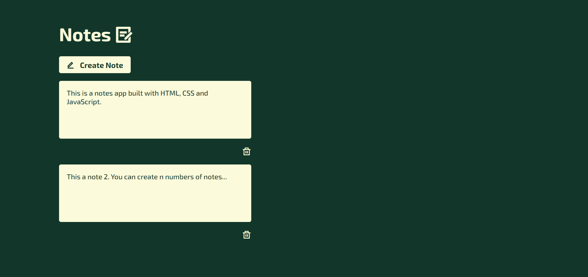

# Notes App



[](https://github.com/adityadhiman-in/notes_app_javascript/blob/main/LICENSE)
[](https://github.com/adityadhiman-in/notes_app_javascript/issues)
[](https://github.com/adityadhiman-in/notes_app_javascript/stargazers)
[](https://github.com/adityadhiman-in/notes_app_javascript/network)

A simple and user-friendly Notes App built using HTML, CSS, and JavaScript. This app allows users to create, edit, and delete notes effortlessly.

## Table of Contents

- [Features](#features)
- [Demo](#demo)
- [Installation](#installation)
- [Usage](#usage)
- [Contributing](#contributing)
- [License](#license)
- [Acknowledgements](#acknowledgements)

## Features

- Create new notes with a single click.
- Edit notes directly within the app.
- Delete notes when they are no longer needed.
- Responsive design for a seamless experience on both desktop and mobile devices.

## Demo

Check out the live demo of the Notes App [here](https://github.com/adityadhiman-in/notes_app_javascript.git).

## Installation

1. Clone the repository:
   ```sh
   git clone https://github.com/adityadhiman-in/notes_app_javascript.git
   ```
2. Navigate to the project directory:
   ```sh
   cd notes_app_javascript
   ```

## Usage

1. Open the `index.html` file in your preferred web browser:
   ```sh
   open index.html
   ```
2. Use the "Create Note" button to add new notes.
3. Click on the notes to edit them.
4. Click on the delete icon to remove notes.

## Contributing

Contributions are welcome! Follow the steps below to contribute:

1. Fork the repository.
2. Create a new branch for your feature or bug fix:
   ```sh
   git checkout -b feature-name
   ```
3. Make your changes and commit them with descriptive messages.
4. Push your changes to your forked repository:
   ```sh
   git push origin feature-name
   ```
5. Open a pull request to the main repository.

## License

This project is licensed under the MIT License.

## Acknowledgements

- [Remixicon](https://remixicon.com/) for the icons used in the project.
- [Google Fonts](https://fonts.google.com/) for the "Exo 2" font.

---

Feel free to customize this `README.md` file to better suit your project's needs. Happy coding!

## Contact

Feel free to reach out if you have any questions or suggestions!

- [Website](https://adityadhiman.in)
- [GitHub](https://github.com/adityadhiman-in)
- [LinkedIn](https://www.linkedin.com/in/adityadhiman-in)

Made with ❤️ by [Aditya Dhiman](https://adityadhiman.in)
